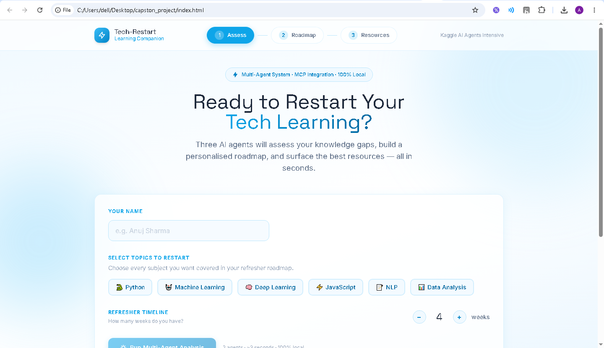
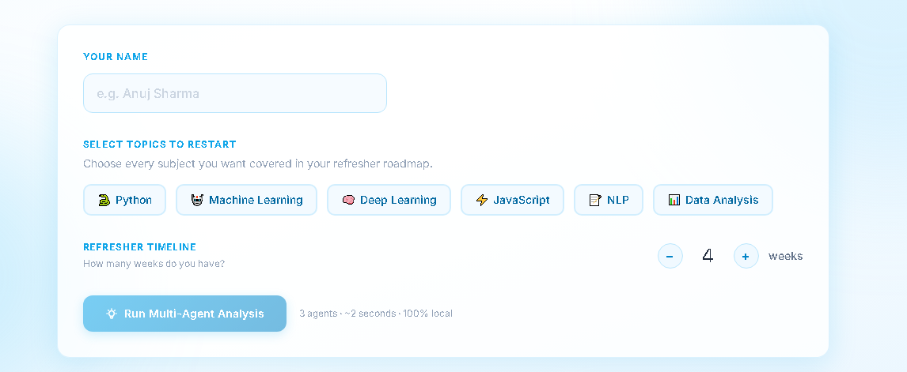
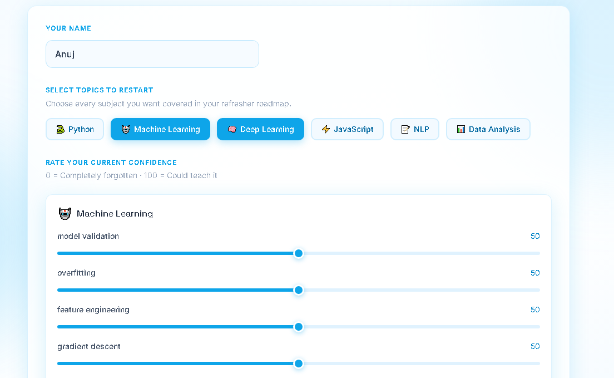
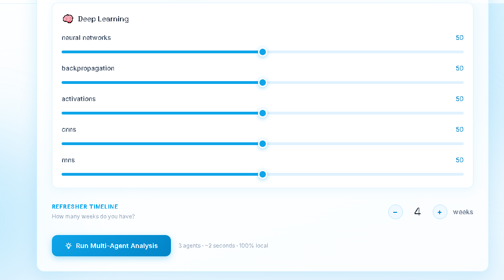
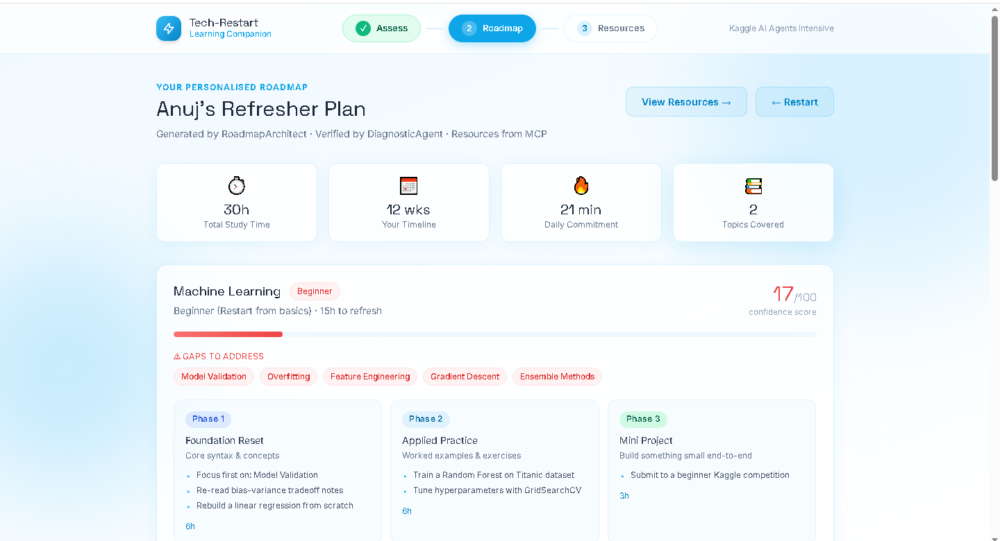
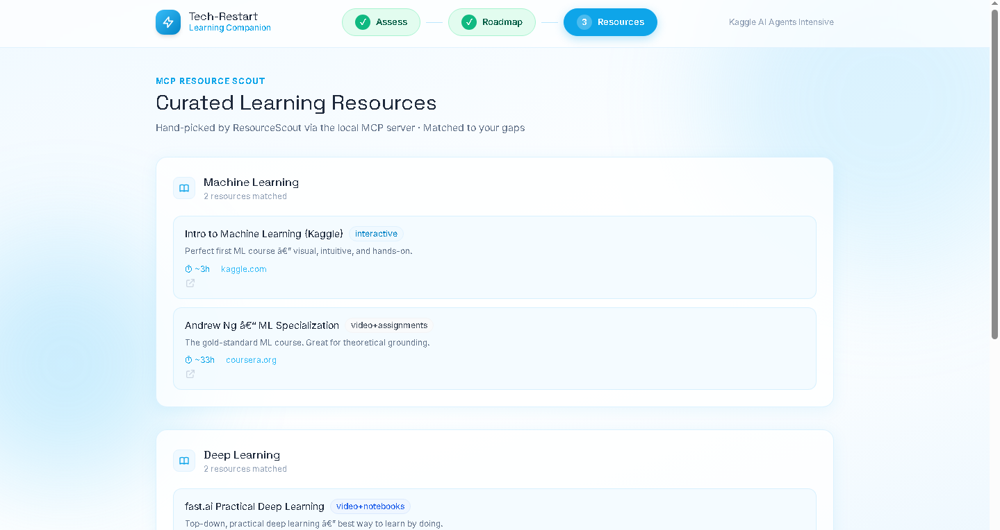
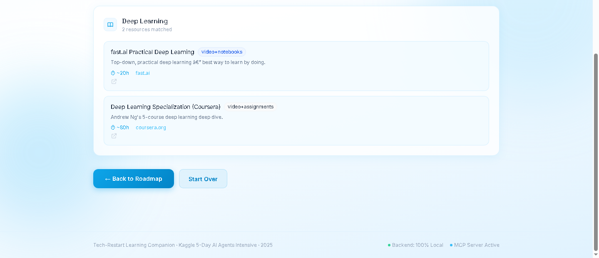

<div align="center">


<br/><br/>

# ⚡ Tech-Restart Learning Companion

**A multi-agent AI system that helps you pick up exactly where your brain left off.**

*Assess knowledge gaps → Generate a personalised roadmap → Surface curated resources*
*— all in under 2 seconds, running 100% locally.*

<br/>

[Getting Started](#-quickstart) · [Screenshots](#-screenshots) · [Architecture](#-architecture) · [API Reference](#-api-reference) · [Kaggle Requirements](#-kaggle-requirements-fulfilled)

</div>

---

## 📸 Screenshots

### 1. Hero Landing Page
> Clean, modern UI with sky-blue glassmorphism design



---

### 2. Assessment Form — Topic Selection
> Select topics and the confidence sliders appear instantly



---

### 3. Confidence Sliders — Machine Learning
> Rate your current confidence (0 = forgotten, 100 = could teach it) per subtopic



---

### 4. Confidence Sliders — Deep Learning
> Each selected topic gets its own subtopic slider set



---

### 5. Personalised Roadmap Result
> RoadmapArchitect generates a phased plan with gaps, milestones, and timeline



---

### 6. MCP Resource Scout — Curated Resources
> ResourceScout fetches level-matched courses from the local MCP server



---

### 7. Resources — Deep Learning Section
> Every resource card links directly to the course with duration and type tag



---

## 🎯 What It Does

Coming back to a technical course after a break is hard — not because you've forgotten everything, but because you don't know *what* you've forgotten. Tech-Restart solves this with three cooperating AI agents:

| Agent | Responsibility | Key Skill |
|---|---|---|
| 🔍 **DiagnosticAgent** | Evaluates confidence across subtopics, identifies critical gaps | `analyze_gaps()` |
| 🗺️ **RoadmapArchitect** | Designs a phased, week-by-week refresher curriculum | `build_roadmap()` |
| 📚 **ResourceScout** | Queries local MCP server for curated, level-matched resources | `scout_resources()` |

**Supported domains:** Python · Machine Learning · Deep Learning · JavaScript · NLP · Data Analysis · AI Agents

---

## 🏗️ Architecture

```
╔══════════════════════════════════════════════════════════════╗
║                     AgentOrchestrator                        ║
║                                                              ║
║  ┌─────────────────┐    ┌──────────────────┐    ┌─────────┐ ║
║  │ DiagnosticAgent │ ──▶│ RoadmapArchitect │ ──▶│Resource │ ║
║  │                 │    │                  │    │ Scout   │ ║
║  │ analyze_gaps()  │    │ build_roadmap()  │    │ (MCP)   │ ║
║  └─────────────────┘    └──────────────────┘    └─────────┘ ║
║         gap_reports  ──▶       roadmap      ──▶  resources  ║
╚══════════════════════════════════════════════════════════════╝
                        │
              Flask REST API  :5000
                        │
          ┌─────────────┴──────────────┐
          │                            │
  ┌───────▼────────┐        ┌──────────▼──────────┐
  │   MCP Server   │        │      Frontend        │
  │    :5001       │        │    index.html        │
  │  course_       │        │   Tailwind CSS       │
  │  library.json  │        │   Vanilla JS         │
  └────────────────┘        └─────────────────────┘
```

### OOP Class Hierarchy

```
BaseAgent  (abstract)
├── DiagnosticAgent    → analyze_gaps(), get_questions()
├── RoadmapArchitect   → build_roadmap(), _generate_milestones()
└── ResourceScout      → scout_resources(), _load_library()

AgentOrchestrator      → run_pipeline(), sanitize_input()
```

---

## 📁 Project Structure

```
tech-restart/
│
├── backend/
│   ├── app.py                  # Agent classes + Flask API (port 5000)
│   ├── mcp_server.py           # MCP Server — 5 typed endpoints (port 5001)
│   ├── course_library.json     # Curated resource database (20+ resources)
│   └── requirements.txt        # flask, flask-cors
│
├── frontend/
│   └── index.html              # Full UI — HTML + Tailwind CSS + Vanilla JS
│                               # Includes offline JS simulation fallback
│
├── assets/
│   └── screenshots/            # UI screenshots
│       ├── 01-hero-landing.png
│       ├── 03-assessment-form.png
│       ├── 04-confidence-sliders-ml.png
│       ├── 05-confidence-sliders-dl.png
│       ├── 06-roadmap-result.png
│       ├── 07-resources-page.png
│       └── 08-resources-deep-learning.png
│
├── README.md
├── PROJECT_WRITEUP.md          # Kaggle submission writeup (~2,400 words)
└── VIDEO_SCRIPT.md             # 5-minute demo video script with timecodes
```

---

## ⚡ Quickstart

### Prerequisites
- Python 3.10+
- A browser (Chrome / Firefox / Edge)
- No API keys · No accounts · No internet required

### 1 — Install dependencies

```bash
cd tech-restart/backend
python -m pip install flask flask-cors
```

### 2 — Start the MCP Server

```bash
# Terminal 1
cd backend
python mcp_server.py
# ✅ Running on http://localhost:5001
```

### 3 — Start the Agent Backend

```bash
# Terminal 2
cd backend
python app.py
# ✅ Running on http://localhost:5000
```

### 4 — Open the Frontend

Simply double-click `frontend/index.html` to open in your browser.

> 💡 **Backend not running?** Open `index.html` directly — the JavaScript offline simulation kicks in automatically and generates a full realistic roadmap.

---

## 🔐 Security Features

| Layer | Mechanism | Detail |
|---|---|---|
| **Orchestrator** | `sanitize_input()` | Strips HTML tags via regex, caps string length at 200 chars |
| **Orchestrator** | Topic allowlist | Only whitelisted topic IDs pass through |
| **Orchestrator** | Score clamping | Confidence values clamped to `[0, 100]` range |
| **MCP Server** | `sanitize_query()` | HTML stripping + 100-char cap on search queries |
| **Frontend** | `sanitizeString()` | Client-side HTML stripping before API call |
| **Frontend** | Input constraints | `maxlength` attributes + chip-only topic selection |

---

## 📡 API Reference

### Agent Backend — `http://localhost:5000`

| Method | Endpoint | Description |
|--------|----------|-------------|
| `GET` | `/api/health` | Health check — returns agent names and version |
| `POST` | `/api/questions` | Fetch quiz questions for selected topics |
| `POST` | `/api/analyze` | **Run full multi-agent pipeline** — main endpoint |
| `POST` | `/api/resources` | Scout resources for a single topic directly |

**Example — `/api/analyze` request body:**
```json
{
  "student_name": "Anuj",
  "topics": ["machine_learning", "deep_learning"],
  "confidence_map": {
    "machine_learning": { "overfitting": 15, "gradient_descent": 10 },
    "deep_learning": { "backpropagation": 20, "cnns": 30 }
  },
  "timeline_weeks": 4
}
```

### MCP Server — `http://localhost:5001`

| Method | Endpoint | MCP Tool | Description |
|--------|----------|----------|-------------|
| `GET` | `/mcp/status` | `mcp_status` | Server health + available topics |
| `GET` | `/mcp/resources` | `list_all_topics` | All topics with resource counts |
| `GET` | `/mcp/resources/<topic>` | `get_resources_by_topic` | All resources for a topic |
| `GET` | `/mcp/resources/<topic>/<level>` | `get_resources_by_topic_and_level` | Beginner or intermediate |
| `GET` | `/mcp/search?q=<query>` | `search_resources` | Full-text search across library |

---

## ✅ Kaggle Requirements Fulfilled

| # | Requirement | Status | Implementation |
|---|-------------|--------|----------------|
| 1 | **Multi-agent system** | ✅ | `DiagnosticAgent` → `RoadmapArchitect` → `ResourceScout` via `AgentOrchestrator` |
| 2 | **MCP Server integration** | ✅ | `mcp_server.py` — standalone Flask MCP server with 5 typed tool endpoints |
| 3 | **Agent Skills / Custom tools** | ✅ | `analyze_gaps()`, `build_roadmap()`, `scout_resources()` as typed Skill methods |
| 4 | **Security features** | ✅ | Multi-layer sanitisation: HTML stripping, allowlists, clamping, query guards |
| 5 | **Deployability** | ✅ | Professional Web UI, 2-command launch, offline JS fallback, zero external deps |

---

## 🔁 Pipeline Flow

```
User Input (topics + confidence scores + timeline)
        │
        ▼
sanitize_input()          ← Security layer
        │
        ▼
DiagnosticAgent.run()     ← Gap reports per topic
        │
        ▼
RoadmapArchitect.run()    ← Phased roadmap + weekly schedule
        │
        ▼
ResourceScout.run()       ← MCP resource fetch + matching
        │
        ▼
Consolidated JSON Response → Frontend renders roadmap
```

**Typical runtime: ~0.5–2 seconds** (rule-based, no LLM latency)

---

## 🦙 Extending with Ollama (Optional)

```bash
# Install Ollama → https://ollama.com/download
ollama pull llama3
```

```python
# In app.py, replace analyze_gaps() logic with:
import requests

response = requests.post("http://localhost:11434/api/generate", json={
    "model": "llama3",
    "prompt": f"Analyse confidence scores for {topic}: {confidence_scores}. Return JSON gap report.",
    "stream": False,
    "format": "json"
})
```

The rest of the pipeline — Roadmap Architect, Resource Scout, Frontend — requires zero changes.

---

## 🛠️ Tech Stack

| Layer | Technology |
|---|---|
| Agent Logic | Python 3.10+ (pure OOP, no ML libs required) |
| API Server | Flask 3.0 + Flask-CORS |
| MCP Server | Flask (standalone, port 5001) |
| Resource Database | JSON (course_library.json) |
| Frontend | HTML5 + Tailwind CSS (CDN) + Vanilla JavaScript |
| Fonts | Space Grotesk + Inter (Google Fonts) |
| Styling | Glassmorphism · Sky blue + white palette |

---

<div align="center">

Developed as a Capstone Project for the **Kaggle 5-Day AI Agents Intensive** Program · 2025

*Zero cloud. Zero API keys. Just agents doing their job.*

</div>
